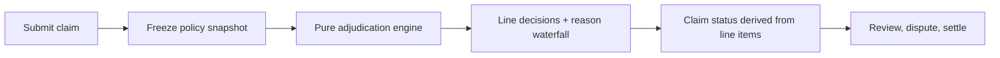
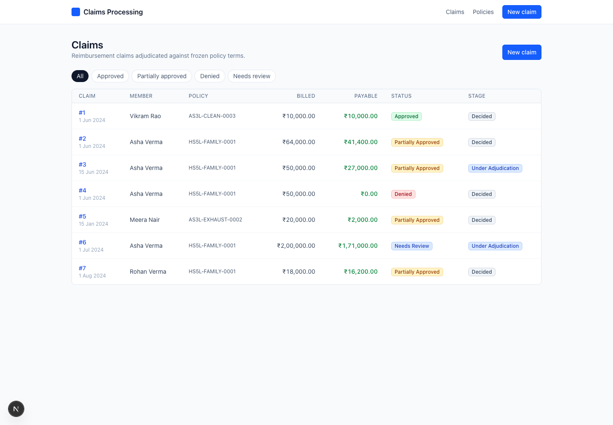
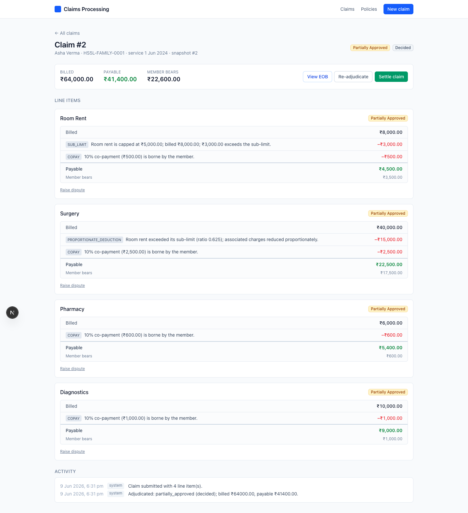
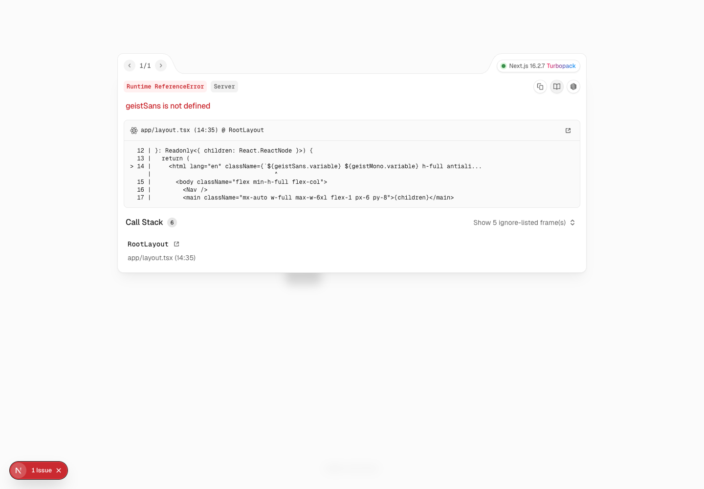
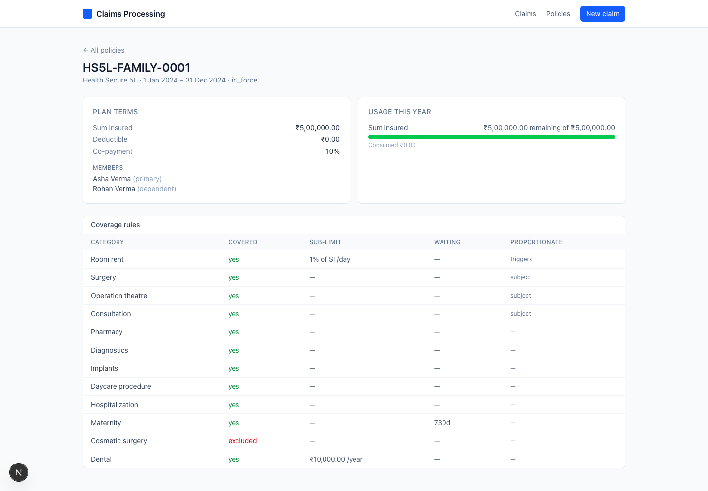

# Claims Processing System - Insurara

A claims-processing system for **Indian health-insurance reimbursement** claims: submit a
claim with line items → adjudicate each line against frozen policy terms → derive the claim
state from its line items → explain every deduction → dispute and re-derive.

- **Backend:** Python / FastAPI + SQLAlchemy + SQLite, with a pure, deterministic
  adjudication engine at its core.
- **Frontend:** Next.js (App Router, TypeScript) + Tailwind.

See `docs/domain-model.md`, `docs/decisions.md`, and `docs/self-review.md` for the design,
trade-offs, and an honest gap list.

## Reviewer quick map

Start with this mental model:



What to look for first:

1. Claim #2 proves the hard Indian-health rule: room-rent cap triggers proportionate
   deduction, but pharmacy and diagnostics are not scaled.
2. Claim #6 proves parent status derivation: a claim with decided lines plus one
   `under_review` line stays `needs_review` until the adjuster resolves it.
3. The claim detail page is the primary review surface: it shows the full Explanation of
   Benefits waterfall, not just a final payable number.

```
app/
  backend/    FastAPI + engine + persistence + tests   (claims/, tests/)
  frontend/   Next.js UI                                (app/, components/, lib/)
docs/         domain-model · decisions · self-review
ai-artifacts/ raw .jsonl agent session logs (required deliverable)
```

---

## Quick start

Prerequisites: [uv](https://docs.astral.sh/uv/) (manages Python 3.11+ automatically) and
Node 20+ / npm.

```bash
./setup.sh    # backend deps (uv sync) + seed the demo DB + frontend deps (npm install)
./dev.sh      # run backend on :8000 (REST + MCP) and frontend on :3000 together
```

Then open **http://localhost:3000**. API docs (Swagger) at **http://localhost:8000/docs**,
health at `/health`. Re-run `./setup.sh` (or `cd app/backend && uv run python -m claims.seed`)
any time to reset the demo data.

Env defaults — override only if needed: `NEXT_PUBLIC_API_BASE_URL=http://localhost:8000`,
`CLAIMS_DB_URL` (a SQLite file at `app/backend/claims.db`), and
`CLAIMS_ALLOWED_ORIGINS` (comma-separated browser origins for local UI ports).

<details>
<summary>Manual setup, without the scripts</summary>

```bash
# backend (port 8000, also serves /mcp) — terminal 1
cd app/backend && uv sync && uv run python -m claims.seed
uv run uvicorn claims.api.app:app --port 8000

# frontend (port 3000) — terminal 2
cd app/frontend && npm install && npm run dev
```
</details>

### Tests
```bash
cd app/backend && uv run pytest -q             # 97 tests
uv run pytest tests/test_worked_example.py     # the worked example (₹64,000 → ₹41,400)
```
The engine tests encode domain rules (one per pipeline step + the composite worked example),
not just HTTP status codes. Frontend checks: `cd app/frontend && npm run lint && npm run build`.

---

## Visual walkthrough

The seeded app is designed so a reviewer can understand the system in a few clicks.

### 1. Claims list

Start at the claims list. The seven seeded claims each demonstrate one rule or lifecycle
case.



### 2. Claim detail and reason waterfall

Open claim #2. Each line item shows billed amount, every reduction reason, payable amount,
and member share.



### 3. Printable EOB

The EOB uses the same `Reason[]` data as the detail page and API explanation endpoint.


### 4. Adjuster review

Open claim #6. One high-value line is routed to review; resolving it re-derives the claim
status.



### 5. Policy usage

After settlement, the policy page shows live usage counters moving. Adjudication itself
uses the frozen snapshot taken when the claim was created.



---

## Walking the demo (7 seeded claims + settlement flow)

Open http://localhost:3000 — the claims list shows seven seeded claims. Each demonstrates
one rule or lifecycle case; settlement can run on any decided claim.

| Claim | Scenario | What it shows |
|------:|----------|---------------|
| #1 | **Clean approval** | small claim within limits, no co-pay → `approved`, no deductions |
| #2 | **Room rent + proportionate deduction** (the worked example) | room ₹8,000 → ₹5,000 cap → ₹4,500 after co-pay; surgery ₹40,000 → ₹25,000 by ratio 0.625 → ₹22,500 after co-pay; pharmacy/diagnostics untouched by proportionate deduction; total **₹41,400** payable, `partially_approved` |
| #3 | **Exclusion + dispute** | cosmetic line `denied` (EXCLUDED); a dispute is pre-raised on it — resolve it (overturn) to see re-derivation |
| #4 | **Waiting period** | maternity within its 730-day wait → `denied` |
| #5 | **Sum-insured exhaustion** | policy with ₹2,98,000 already consumed → surgery reduced to the ₹2,000 remaining |
| #6 | **Needs review** ("3 covered, 1 denied, 1 needs review") | implants ₹1,50,000 routes to `under_review`; resolve it via the adjuster panel and watch the claim re-derive |
| #7 | **Family floater** | a dependent draws on the same policy/pool as the primary |
| (any) | **Settle** | settle an approved/partial claim → lines `paid`, then open its policy to see the usage bar move |

The **claim-detail page** is the primary review surface: each line item renders a reason-waterfall
(billed → each deduction with its amount and message → payable), so you can see *why*
₹8,000 became ₹5,000. The same data is available as a printable EOB and via
`GET /api/claims/{id}/explanation`.

### Driving it from the API instead
The interface can be the REST API alone — explore it at `/docs`. Submit a claim with
`POST /api/claims`, then `GET /api/claims/{id}` and `/explanation`; resolve reviews, settle,
and dispute via the documented endpoints.

---

## Reviewer MCP (mounted in the backend)

The same backend process also serves an **MCP server at `http://localhost:8000/mcp`**
(streamable HTTP) — starting `uvicorn` starts it too, no separate process. Point any MCP
client at it to explore the assignment docs (as resources) and drive the live system with
the *same controllers* the REST API uses (so answers match exactly). REST routers and MCP
tools are thin adapters over `claims/application/controllers.py`.

See [**`REVIEWER_GUIDE.md`**](./REVIEWER_GUIDE.md) for connecting a client, the full tool/resource list, and
example questions. Quick check that MCP is live:

```bash
curl -s -X POST localhost:8000/mcp/ \
  -H 'Content-Type: application/json' -H 'Accept: application/json, text/event-stream' \
  -d '{"jsonrpc":"2.0","id":1,"method":"initialize","params":{"protocolVersion":"2025-06-18","capabilities":{},"clientInfo":{"name":"probe","version":"0"}}}'
```

---
